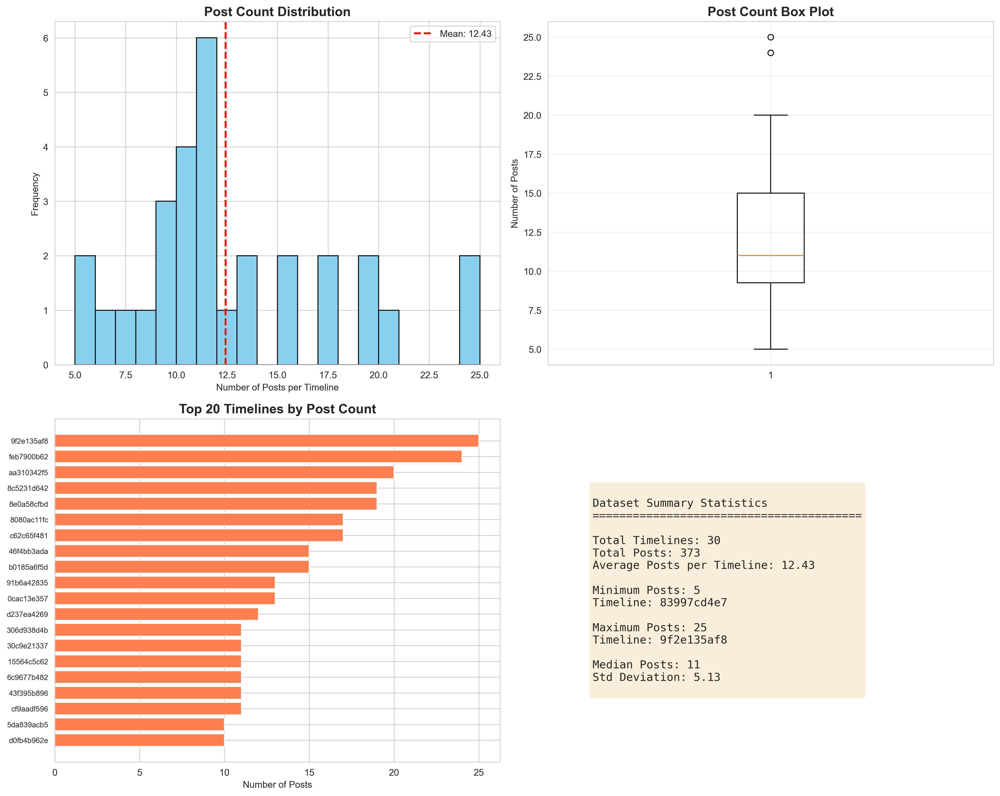
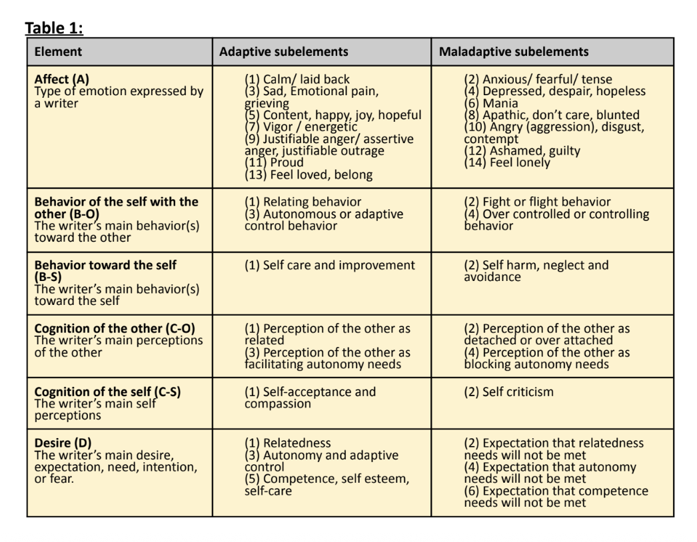

# CLPsych 2026 - McMaster NLP

## Data Preprocessing

This repository contains scripts for preprocessing CLPsych timeline data.

### Setup

1. Clone the repository:
```bash
git clone <repository-url>
cd CLPsych-2026-McMasterNLP
```

2. Download the dataset into the repository directory

3. Install required dependencies:
```bash
pip install -r requirements.txt
```

### Usage

Run all cells in the `preprocess_data.ipynb` notebook to process the data:

```bash
jupyter notebook preprocess_data.ipynb
```

Or open the notebook in VS Code and run all cells.

### Output

The preprocessing script will generate:
- `dataset_statistics.png` - Statistical visualization of the dataset
- `csv_files/` - Individual CSV files for each timeline
- `all_timelines_merged.csv` - Merged CSV file with all timelines

### Dataset Statistics



The visualization shows:
- Post count distribution across timelines
- Box plot of post counts
- Top 20 timelines by post count
- Summary statistics (total timelines, posts, averages, etc.)
## Dataset Definitions
- `switch`: S (detected) or 0; A switch reflects a substantial and sudden change in well-being between two consecutive posts.
- `escalation`: E (detected) or 0; An escalation refers to a gradual intensification of mood over a sequence of
consecutive posts.
- `well_being`: 1 - 10 well-being score; 1 being the worst and 10 being the person is doing well.
- `adaptive-state`: conducive to the fulfillment of basic desires/needs.
- `maladaptive-state`: hinder the fulfillment of basic desires/needs.
- `presence`: 1 - 5; Presence refers to the extent to which the self state (adaptive/maladaptive) influences the person’s expressed experience in the post.
- Table 1 in `CLPsych2026_Guidelines.pdf` explains what each ABCD means and the subelements (aka `category`) associated with each


